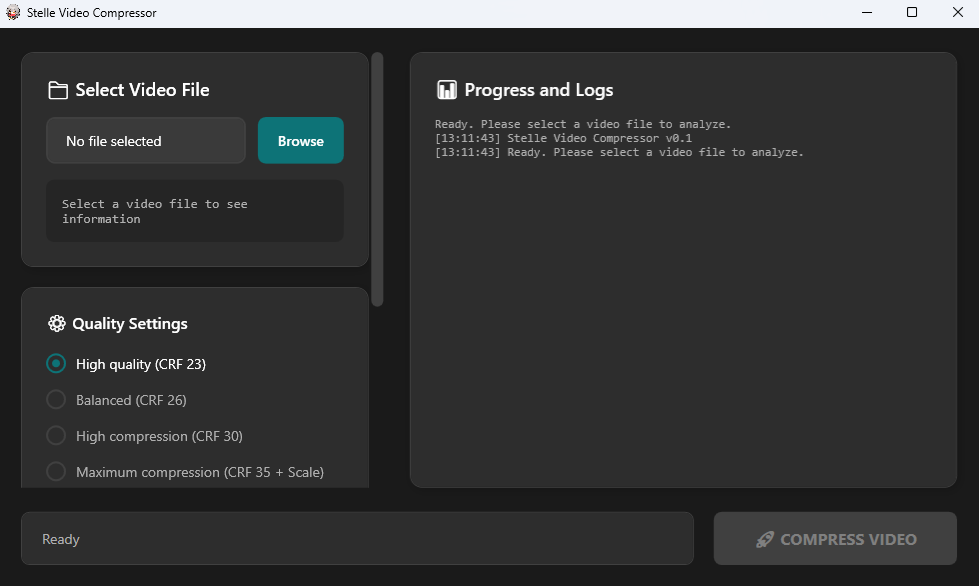

# Stelle Video Compressor

A simple and user-friendly video compression tool built with WPF and FFmpeg. Compress your videos with modern dark UI and real-time progress tracking.




## Features

- **Multiple Quality Presets**: High quality (CRF 23), Balanced (CRF 26), High compression (CRF 30), Maximum compression (CRF 35 + Scale)
- **Codec Support**: H.264 (libx264) and H.265 (libx265)
- **Audio Options**: Keep original, compress to 128k/96k/64k, or remove audio entirely
- **Real-time Progress**: Live compression progress with detailed logs
- **File Size Comparison**: See before/after file sizes and compression percentage
- **Modern Dark UI**: Clean, responsive interface with custom styling

## Download

Download the latest release from the [Releases](https://github.com/Dlcuy22/Stelle-Video-Compressor/releases) page. The release includes:

- Complete standalone application
- Built-in FFmpeg and FFprobe executables
- No additional installation required

## Requirements

- Windows 10/11
- .NET 9.0 Desktop Runtime (will be prompted to download if you don't have it)

## Usage

1. **Select Video File**: Click "Browse" to choose your video file
2. **Choose Settings**: 
   - Select quality preset (higher CRF = smaller file, lower quality)
   - Choose video codec (H.264 for compatibility, H.265 for better compression)
   - Set audio options based on your needs
3. **Compress**: Click "COMPRESS VIDEO" and monitor progress in real-time
4. **Results**: View compression results and optionally open the output folder

## Supported Formats

**Input**: MP4, AVI, MKV, MOV, WMV, FLV, WebM, M4V, 3GP, TS, MTS
**Output**: MP4

## FFmpeg Dependencies

This application uses FFmpeg for video processing. The standalone release includes:

- `ffmpeg.exe` - Video compression engine
- `ffprobe.exe` - Video analysis tool

These executables are bundled with the application to provide a complete, ready-to-use experience without requiring separate FFmpeg installation.

## Building from Source

### Prerequisites
- Visual Studio 2022 or later
- .NET 9.0 SDK
- FFmpeg executables (place `ffmpeg.exe` and `ffprobe.exe` in the output directory)

### Build Steps
1. Clone the repository
```bash
git clone https://github.com/Dlcuy22/Stelle-Video-Compressor
cd Stelle-Video-Compressor
```

2. Build the project
```bash
dotnet build --configuration Release
```

3. Add FFmpeg executables to the output folder:
   - Download FFmpeg from https://ffmpeg.org/download.html
   - Copy `ffmpeg.exe` and `ffprobe.exe` to the build output directory

## Technical Details

- **Framework**: .NET 9.0 with WPF
- **Video Processing**: FFmpeg
- **UI**: Custom dark theme with modern styling
- **Progress Tracking**: Real-time stderr parsing from FFmpeg output

## License

This project is open source. FFmpeg is licensed under the LGPL/GPL license.

## Contributing

Feel free to open issues or submit pull requests for improvements and bug fixes.
